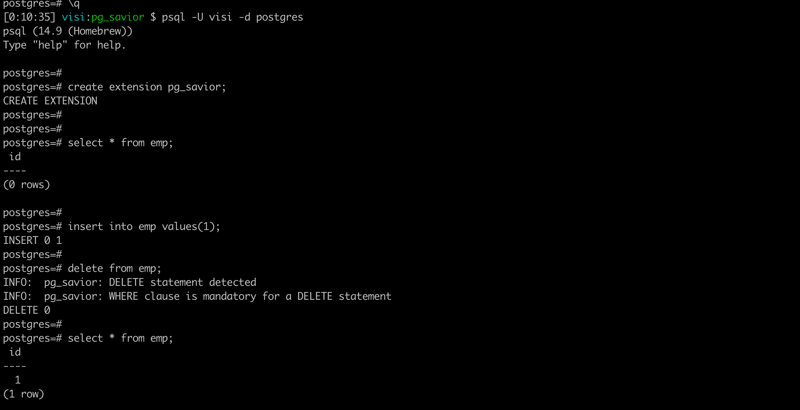

# pg_savior

pg_savior is a PostgreSQL extension designed to prevent accidental data loss due to non-parameterized DELETE queries without a WHERE clause.

## Features

- Detects DELETE queries without a WHERE clause.
- Logs detailed information about detected queries.
- Hooks into the PostgreSQL query execution process.

## Installation

Source:

1. Clone the repository or [download from PGXN](https://pgxn.org/extension/pg_savior)
2. Navigate to the repository directory.
3. Run `make` to build the extension.
4. Run `make install` to install the extension.

## Demo


## Usage

After installing the extension, you can enable it in your PostgreSQL database with the following command:

```sql
CREATE EXTENSION pg_savior;
```